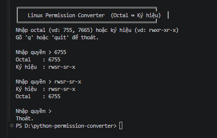

# Permission Converter

A compact Python tool that quickly converts between system permission formats such as Input Permission, Octal Numbers (755, 644) and rwx notation in Linux.

## How to run the project

This project is very simple and does not require installing any external libraries. You just need to do the following:

1. Your computer must have **Python** (version 3.13 or later) installed.

2. Open the folder containing this project using **Visual Studio Code**.

3. Open the `permission_converter.py` file.

4. Press the **F5** key on your keyboard to run the program or Run --> Start Debugging to run the program.

5. click Ctrl + C in keyboard to exit if done

## Features

* Converts formats Easy rights form between Octal --> Symbol